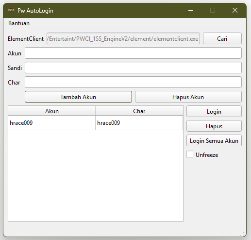

## 📌 PWCI Auto Login

**PWCI Auto Login** adalah aplikasi berbasis GUI (Qt6) yang dirancang untuk membantu pemain *Perfect World Classic Indonesia* melakukan login otomatis ke dalam game, dengan fitur manajemen akun yang aman dan praktis.

### 🎯 Fitur Utama

* ✅ Auto login ke `elementclient.exe` dengan parameter CLI
* 🔐 Password terenkripsi (AES-256)
* 👥 Manajemen akun (Tambah, Hapus, Edit)
* 🌐 Pemilihan server
* 🧙 Pemilihan karakter
* 🪟 Tampilan GUI berbasis Qt (standalone-ready)
* 🗂️ Struktur siap compile dengan **Visual Studio 2022**

### 🧰 Struktur Proyek

```
PWCI-Auto-Login/
├── src/                    # Source utama
│   ├── main.cpp
│   ├── mainwindow.{h,cpp,ui}
│   ├── chardata.{h,cpp}
│   └── charmodel.{h,cpp}
├── resources.qrc          # Resource file (ikon, gambar)
├── pw-auto-login.pro      # Qt project file
├── LICENSE
└── README.md
```

### 🛠️ Build & Compile

#### ✅ Prasyarat:

* **Qt 6.5+**
* **Visual Studio 2022**
* `windeployqt` untuk membuat versi standalone

#### 🔧 Cara Compile (Windows):

1. Buka `Qt Creator` atau VS2022 (dengan Qt Plugin)
2. Buka file `pw-auto-login.pro`
3. Pastikan kit menggunakan Qt 6 + MSVC 2022
4. Build → Run
5. Untuk versi standalone:

   ```bash
   windeployqt --qmldir . pw-auto-login.exe
   ```

### 🔐 Tentang Enkripsi

Password yang disimpan di aplikasi ini akan dienkripsi menggunakan AES, bukan Base64. File konfigurasi akun disimpan lokal dan tidak dikirim ke mana pun.

### 🖼️ Tampilan Antarmuka



### 🤝 Kontribusi

Pull request dan issue sangat diterima! Silakan fork repo ini dan buat fitur atau perbaikan sesuai kebutuhan komunitas PWCI.

### 📄 Lisensi

LGPL 3.0 License — lihat file ['LICENSE'](LICENSE) untuk detail.
